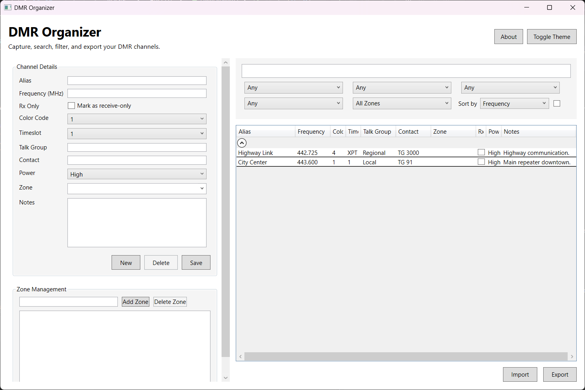

# DMR Organizer

  

A WPF desktop app for organizing DMR channel data. Add, edit, delete, filter, import/export, and auto-save your channel list with simple zone management.

## Features
- Channel management: add, edit, delete with validation and duplicate checks (Frequency + Color Code + Timeslot).
- Zone management: add/delete zones; channels stay grouped; zone filters update automatically.
- Filtering and sorting: search box, timeslot/color/power/rx-only/zone filters, grouping, and sort toggles.
- Import/Export: CSV and JSON import; CSV/JSON/XLSX export.
- Auto-save: keeps a rolling copy at `%AppData%\DMROrganizer\autosave.csv` and loads it on startup when present.
- Theme toggle: light/dark.
- About box: shows `WKSUK`, `Version 1.0`, and ORCID ID.

## Screenshots



## Requirements
- .NET 10 SDK
- Visual Studio 2022 or newer (recommended for WPF designer) or `dotnet` CLI

## Getting Started
1. Clone the repo from GitHub.
2. Open `DMROrganizer/DMROrganizer.csproj` in Visual Studio **or** run `dotnet build` at the repo root.
3. Run from Visual Studio (F5) or via CLI:
   ```bash
   dotnet run --project DMROrganizer/DMROrganizer.csproj
   ```

## Usage
- Add/edit channels: use the form on the left. Select a row in the grid to load it, then `Save`. Use `New` to clear the form and `Delete` to remove the selected channel.
- Zones: add or delete in the Zone Management panel. Deleting a zone clears that zone from affected channels.
- Import/Export: buttons under the grid. Keep using CSV for portability; XLSX export is available.
- Auto-save: no action needed; a backup is kept at `%AppData%\DMROrganizer\autosave.csv`.
- About: click `About` for app info.

## Project Structure
- `DMROrganizer/` – WPF application (views, view-models, models, services)
- `DMROrganizer/ViewModels/MainViewModel.cs` – UI logic, commands, autosave
- `DMROrganizer/MainWindow.xaml` – main UI layout
- `DMROrganizer/Services/ChannelPersistenceService.cs` – import/export implementations

## License
This project is licensed under the MIT License. See `LICENSE` for details.
